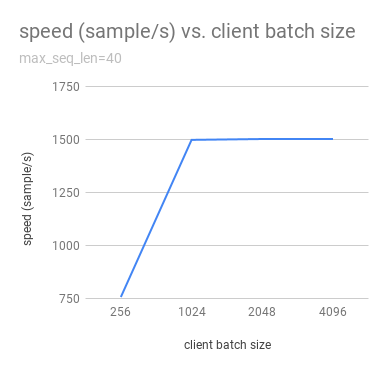
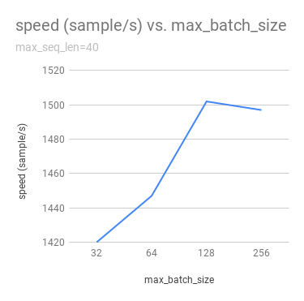
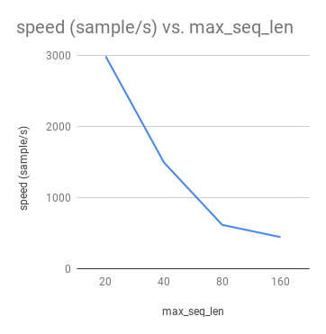

# bert-as-service

[](https://opensource.org/licenses/MIT)    [](https://opensource.org/licenses/MIT)  [](https://opensource.org/licenses/MIT)

Using BERT model as a sentence encoding service, i.e. mapping a variable-length sentence to a fixed-length vector.


Author: Han Xiao [https://hanxiao.github.io](https://hanxiao.github.io)

[BERT code of this repo](bert/) is forked from the [original BERT repo]((https://github.com/google-research/bert)) with necessary modification, [especially in extract_features.py](bert/extract_features.py).


## What is it?

**BERT**: [Developed by Google](https://github.com/google-research/bert), BERT is a method of pre-training language representations. It leverages an enormous amount of plain text data publicly available on the web and is trained in an unsupervised manner. Pre-training a BERT model is a fairly expensive yet one-time procedure for each language. Fortunately, Google released several pre-trained models where [you can download from here](https://github.com/google-research/bert#pre-trained-models).


**Sentence Encoding/Embedding**: sentence encoding is a upstream task required in many NLP applications, e.g. sentiment analysis, text classification. The goal is to represent a variable length sentence into a fixed length vector, each element of which should "encode" some semantics of the original sentence.

**Finally, this repo**: This repo uses BERT as the sentence encoder and hosts it as a service via ZeroMQ, allowing you to map sentences into fixed-length representations in just two lines of code. 

## Usage

#### 1. Download the Pre-trained BERT Model
Download it from [here](https://github.com/google-research/bert#pre-trained-models), then uncompress the zip file into some folder, say `/tmp/english_L-12_H-768_A-12/`


#### 2. Start a BERT service
```bash
python app.py -num_worker=4 -model_dir /tmp/english_L-12_H-768_A-12/
```
This will start a service with four workers, meaning that it can handel up to four **concurrent** requests. (These workers are behind a simple load balancer.)

#### 3. Use Client to Encode Sentences
> NOTE: please make sure your project includes [`client.py`](service/client.py), as we need to import `BertClient` class from this file. This is the **only file** that you will need as a client. You don't even need Tensorflow on client.

Now you can use pretrained BERT to encode sentences in your Python code simply as follows:
```python
from service.client import BertClient
ec = BertClient()
ec.encode(['abc', 'defg', 'uwxyz'])
```
This will return a python object with type `List[List[float]]`, each element of the outer `List` is the fixed representation of a sentence.

### Using BERT Service Remotely
One can also start the service on one (GPU) machine and call it from another (CPU) machine as follows

```python
# on another CPU machine
from service.client import BertClient
ec = BertClient(ip='xx.xx.xx.xx', port=5555)  # ip address of the GPU machine
ec.encode(['abc', 'defg', 'uwxyz'])
```

> NOTE: please make sure your project includes [`client.py`](service/client.py), as we need to import `BertClient` class from this file. Again, this is the **only file** that you will need as a client. You don't even need Tensorflow on client.
 
## QA on Technical Details

**Q:** Where do you get the fixed representation? Did you do pooling or something?

**A:** I take the second-to-last hidden layer of all of the tokens in the sentence and do average pooling. See [the function I added to the modeling.py](bert/modeling.py#L236)

**Q:** Why not use the hidden state of the first token, i.e. the `[CLS]`?

**A:** Because a pre-trained model is not fine-tuned on any downstream tasks yet. In this case, the hidden state of `[CLS]` is not a good sentence representation. If later you fine-tune the model, you may [use `get_pooled_output()` to get the fixed length representation](bert/modeling.py#L224) as well.

**Q:** Why not the last hidden layer? Why second-to-last?

**A:** The last layer is too closed to the target functions (i.e. masked language model and next sentence prediction) during pre-training, therefore may be biased to those targets.

**Q:** Could I use other pooling techniques?

**A:** For sure. Just follows [`get_sentence_encoding()` I added to the modeling.py](bert/modeling.py#L236). Note that, if you introduce new `tf.variables` to the graph, then you need to train those variables before using the model. You may also want to check [some pooling techniques I mentioned in my blog post](https://hanxiao.github.io/2018/06/24/4-Encoding-Blocks-You-Need-to-Know-Besides-LSTM-RNN-in-Tensorflow/#pooling-block).

**Q:** Can I start multiple clients and send requests to one server simultaneously?

**A:** Yes! That's the purpose of this repo. In fact you can start as many clients as you want. One server can handle all of them (given enough time).

**Q:** How many requests can one service handle concurrently?

**A:** The maximum number of concurrent requests is determined by `num_worker` in `app.py`. If you a sending more than `num_worker` requests concurrently, the new requests will be temporally stored in a queue until a free worker becomes available.

**Q:** So one request means one sentence?

**A:** No. One request means a list of sentences sent from a client. Think the size of a request as the batch size. A request may contain 256, 512 or 1024 sentences. The optimal size of a request is often determined empirically. One large request can certainly improve the GPU utilization, yet it also increases the overhead of transmission. You may run `python client_example.py` for a simple benchmark.

**Q:** How about the speed? Is it fast enough for production?

**A:** It highly depends on the `max_seq_len` and the size of a request. On a single Tesla M40 24GB with `max_seq_len=25`, you should get about 390/s using a 12-layer BERT. In general, I'd suggest smaller `max_seq_len` (25) and larger request size (512/1024).

**Q:** Did you benchmark the efficiency?

**A:** Yes. I tested the service speed in terms of number of processed sentences per second under different `max_seq_len` (a server side parameter) and batch size (a client side parameter). Here are the results on 6-core Tesla M40 24GB:



To reproduce the results, please refer to [benchmark.py](benchmark.py).

**Q:** What is backend based on?

**A:** [ZeroMQ](http://zeromq.org/).


**Q:** Do I need Tensorflow on the client side?

**A:** No. Think of `BertClient` as a general feature extractor, whose output can be fed to *any* ML models, e.g. `scikit-learn`, `pytorch`, `tensorflow`. The only file that client need is [`client.py`](service/client.py). Copy this file to your project and import it, then you are ready to go.


