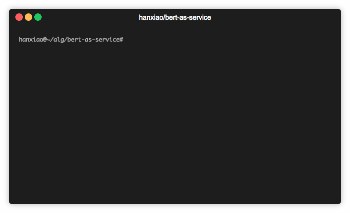

bert-as-service Documentation
=============================

``bert-as-service`` is a sentence encoding service for mapping a variable-length sentence to a fixed-length vector.

Installation
------------

The best way to install the ``bert-as-service`` is via pip. Note that the server and  client can be installed separately or even on different machines:

.. highlight:: bash
.. code-block:: bash

    pip install -U bert-serving-server bert-serving-client

.. Note:: The server MUST be running on **Python >= 3.5** with **Tensorflow >= 1.10** (*one-point-ten*). Again, the server does not support Python 2!

.. Note:: The client can be running on both Python 2 and 3.

Table of Content
----------------

.. toctree::
   :maxdepth: 2

   section/what-is-it
   section/get-start
   tutorial/index
   source/client
   source/server
   section/faq
   section/benchmark

Indices and tables
==================

* :ref:`genindex`
* :ref:`modindex`
* :ref:`search`

