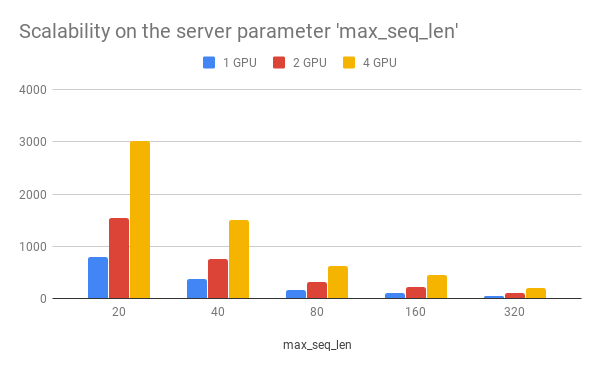
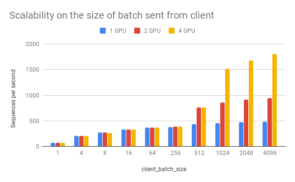
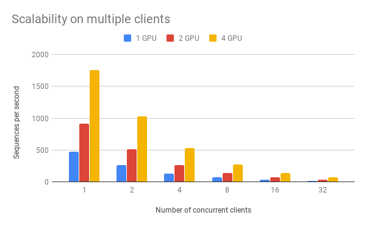
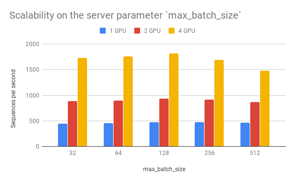
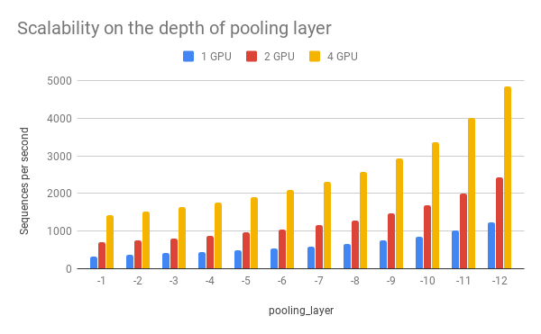

Benchmark
=========

.. contents:: :local:

The primary goal of benchmarking is to test the scalability and the
speed of this service, which is crucial for using it in a dev/prod
environment. Benchmark was done on Tesla M40 24GB, experiments were
repeated 10 times and the average value is reported.

To reproduce the results, please run

.. highlight:: bash
.. code:: bash

   bert-serving-benchmark --help

Common arguments across all experiments are:

================= =====
Parameter         Value
================= =====
num_worker        1,2,4
max_seq_len       40
client_batch_size 2048
max_batch_size    256
num_client        1
================= =====

.. _speed-wrt-max_seq_len:

Speed wrt. ``max_seq_len``
^^^^^^^^^^^^^^^^^^^^^^^^^^

``max_seq_len`` is a parameter on the server side, which controls the
maximum length of a sequence that a BERT model can handle. Sequences
larger than ``max_seq_len`` will be truncated on the left side. Thus, if
your client want to send long sequences to the model, please make sure
the server can handle them correctly.

Performance-wise, longer sequences means slower speed and more chance of
OOM, as the multi-head self-attention (the core unit of BERT) needs to
do dot products and matrix multiplications between every two symbols in
the sequence.

=============== ===== ===== =====
``max_seq_len`` 1 GPU 2 GPU 4 GPU
=============== ===== ===== =====
20              903   1774  3254
40              473   919   1687
80              231   435   768
160             119   237   464
320             54    108   212
=============== ===== ===== =====

.. _speed-wrt-client_batch_size:

Speed wrt. ``client_batch_size``
^^^^^^^^^^^^^^^^^^^^^^^^^^^^^^^^

``client_batch_size`` is the number of sequences from a client when
invoking ``encode()``. For performance reason, please consider encoding
sequences in batch rather than encoding them one by one.

For example, do:

.. highlight:: python
.. code:: python

   # prepare your sent in advance
   bc = BertClient()
   my_sentences = [s for s in my_corpus.iter()]
   # doing encoding in one-shot
   vec = bc.encode(my_sentences)

DON'T:

.. highlight:: python
.. code:: python

   bc = BertClient()
   vec = []
   for s in my_corpus.iter():
       vec.append(bc.encode(s))

It's even worse if you put ``BertClient()`` inside the loop. Don't do
that.

===================== ===== ===== =====
``client_batch_size`` 1 GPU 2 GPU 4 GPU
===================== ===== ===== =====
1                     75    74    72
4                     206   205   201
8                     274   270   267
16                    332   329   330
64                    365   365   365
256                   382   383   383
512                   432   766   762
1024                  459   862   1517
2048                  473   917   1681
4096                  481   943   1809
===================== ===== ===== =====

.. _speed-wrt-num_client:

Speed wrt. ``num_client``
^^^^^^^^^^^^^^^^^^^^^^^^^

``num_client`` represents the number of concurrent clients connected to
the server at the same time.

============== ===== ===== =====
``num_client`` 1 GPU 2 GPU 4 GPU
============== ===== ===== =====
1              473   919   1759
2              261   512   1028
4              133   267   533
8              67    136   270
16             34    68    136
32             17    34    68
============== ===== ===== =====

As one can observe, 1 clients 1 GPU = 381 seqs/s, 2 clients 2 GPU 402
seqs/s, 4 clients 4 GPU 413 seqs/s. This shows the efficiency of our
parallel pipeline and job scheduling, as the service can leverage the
GPU time more exhaustively as concurrent requests increase.

.. _speed-wrt-max_batch_size:

Speed wrt. ``max_batch_size``
^^^^^^^^^^^^^^^^^^^^^^^^^^^^^

``max_batch_size`` is a parameter on the server side, which controls the
maximum number of samples per batch per worker. If a incoming batch from
client is larger than ``max_batch_size``, the server will split it into
small batches so that each of them is less or equal than
``max_batch_size`` before sending it to workers.

================== ===== ===== =====
``max_batch_size`` 1 GPU 2 GPU 4 GPU
================== ===== ===== =====
32                 450   887   1726
64                 459   897   1759
128                473   931   1816
256                473   919   1688
512                464   866   1483
================== ===== ===== =====

.. _speed-wrt-pooling_layer:

Speed wrt. ``pooling_layer``
^^^^^^^^^^^^^^^^^^^^^^^^^^^^

``pooling_layer`` determines the encoding layer that pooling operates
on. For example, in a 12-layer BERT model, ``-1`` represents the layer
closed to the output, ``-12`` represents the layer closed to the
embedding layer. As one can observe below, the depth of the pooling
layer affects the speed.

================= ===== ===== =====
``pooling_layer`` 1 GPU 2 GPU 4 GPU
================= ===== ===== =====
[-1]              438   844   1568
[-2]              475   916   1686
[-3]              516   995   1823
[-4]              569   1076  1986
[-5]              633   1193  2184
[-6]              711   1340  2430
[-7]              820   1528  2729
[-8]              945   1772  3104
[-9]              1128  2047  3622
[-10]             1392  2542  4241
[-11]             1523  2737  4752
[-12]             1568  2985  5303
================= ===== ===== =====
