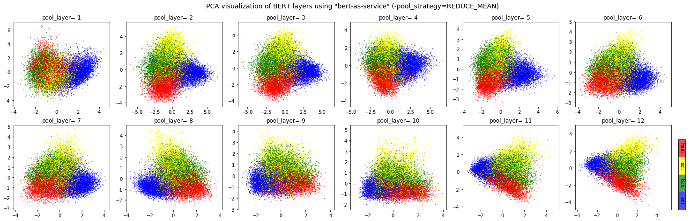
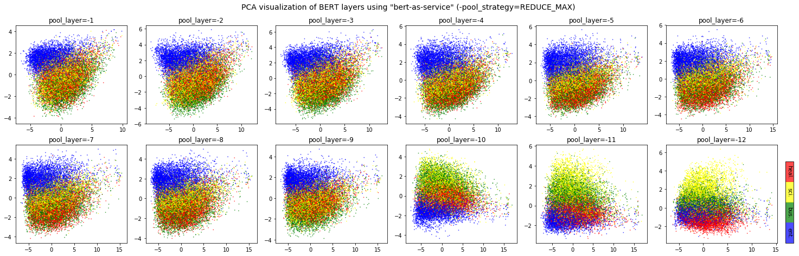
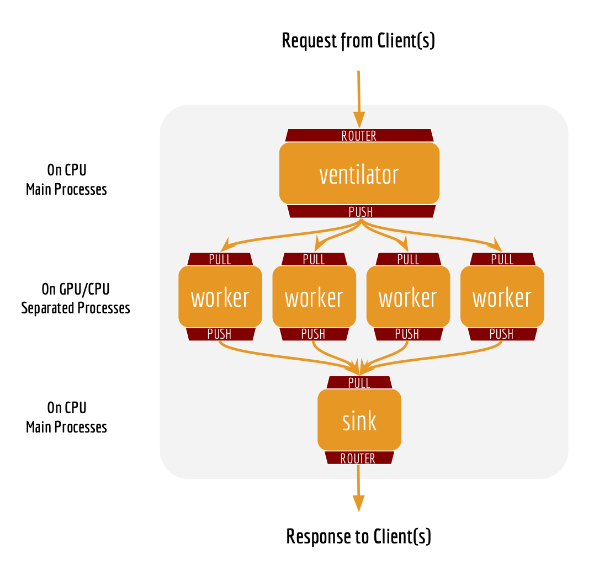
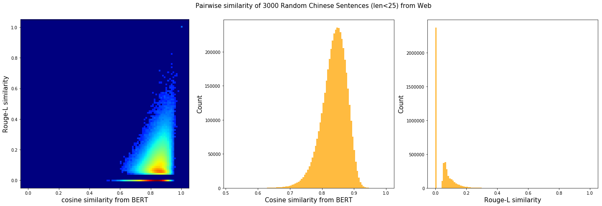

Frequently Asked Questions
==========================

.. contents:: :local:


Where is the BERT code come from?
''''''''''''''''''''''''''''''''''''''''

`BERT code of this repo`_ is forked from the `original BERT
repo`_ with necessary modification, `especially in
extract_features.py`_.

How large is a sentence vector?
''''''''''''''''''''''''''''''''''''''

In general, each sentence is translated to a 768-dimensional vector.
Depending on the pretrained BERT you are using, ``pooling_strategy`` and
``pooling_layer`` the dimensions of the output vector could be
different.

How do you get the fixed representation? Did you do pooling or something?
''''''''''''''''''''''''''''''''''''''''''''''''''''''''''''''''''''''''''''''''

Yes, pooling is required to get a fixed representation of a
sentence. In the default strategy ``REDUCE_MEAN``, I take the
second-to-last hidden layer of all of the tokens in the sentence and do
average pooling.

Are you suggesting using BERT without fine-tuning?
'''''''''''''''''''''''''''''''''''''''''''''''''''''''''

Yes and no. On the one hand, Google pretrained BERT on Wikipedia
data, thus should encode enough prior knowledge of the language into the
model. Having such feature is not a bad idea. On the other hand, these
prior knowledge is not specific to any particular domain. It should be
totally reasonable if the performance is not ideal if you are using it
on, for example, classifying legal cases. Nonetheless, you can always
first fine-tune your own BERT on the downstream task and then use
``bert-as-service`` to extract the feature vectors efficiently. Keep in
mind that ``bert-as-service`` is just a feature extraction service based
on BERT. Nothing stops you from using a fine-tuned BERT.

.. _q-can-i-get-a-concatenation-of-several-layers-instead-of-a-single-layer-:

Can I get a concatenation of several layers instead of a single layer ?
''''''''''''''''''''''''''''''''''''''''''''''''''''''''''''''''''''''''''''''

Sure! Just use a list of the layer you want to concatenate when
calling the server. Example:

.. highlight:: bash
.. code:: bash

   bert_serving_start -pooling_layer -4 -3 -2 -1 -model_dir /tmp/english_L-12_H-768_A-12/

What are the available pooling strategies?
'''''''''''''''''''''''''''''''''''''''''''''''''

Here is a table summarizes all pooling strategies I implemented.
Choose your favorite one by specifying
``bert_serving_start -pooling_strategy``.

================================ ========================================================================================================================================================================
Strategy                         Description
================================ ========================================================================================================================================================================
``NONE``                         no pooling at all, useful when you want to use word embedding instead of sentence embedding. This will results in a ``[max_seq_len, 768]`` encode matrix for a sequence.
``REDUCE_MEAN``                  take the average of the hidden state of encoding layer on the time axis
``REDUCE_MAX``                   take the maximum of the hidden state of encoding layer on the time axis
``REDUCE_MEAN_MAX``              do ``REDUCE_MEAN`` and ``REDUCE_MAX`` separately and then concat them together on the last axis, resulting in 1536-dim sentence encodes
``CLS_TOKEN`` or ``FIRST_TOKEN`` get the hidden state corresponding to ``[CLS]``, i.e. the first token
``SEP_TOKEN`` or ``LAST_TOKEN``  get the hidden state corresponding to ``[SEP]``, i.e. the last token
================================ ========================================================================================================================================================================

.. _q-why-not-use-the-hidden-state-of-the-first-token-as-default-strategy-ie-the-cls:

Why not use the hidden state of the first token as default strategy, i.e. the ``[CLS]``?
'''''''''''''''''''''''''''''''''''''''''''''''''''''''''''''''''''''''''''''''''''''''''''''''

Because a pre-trained model is not fine-tuned on any downstream
tasks yet. In this case, the hidden state of ``[CLS]`` is not a good
sentence representation. If later you fine-tune the model, you may use
``[CLS]`` as well.

BERT has 12/24 layers, so which layer are you talking about?
'''''''''''''''''''''''''''''''''''''''''''''''''''''''''''''''''''

By default this service works on the second last layer, i.e.
``pooling_layer=-2``. You can change it by setting ``pooling_layer`` to
other negative values, e.g. -1 corresponds to the last layer.

Why not the last hidden layer? Why second-to-last?
'''''''''''''''''''''''''''''''''''''''''''''''''''''''''

The last layer is too closed to the target functions (i.e. masked
language model and next sentence prediction) during pre-training,
therefore may be biased to those targets. If you question about this
argument and want to use the last hidden layer anyway, please feel free
to set ``pooling_layer=-1``.

So which layer and which pooling strategy is the best?
'''''''''''''''''''''''''''''''''''''''''''''''''''''''''''''

It depends. Keep in mind that different BERT layers capture
different information. To see that more clearly, here is a visualization
on `UCI-News Aggregator Dataset`_, where I randomly sample 20K news
titles; get sentence encodes from different layers and with different
pooling strategies, finally reduce it to 2D via PCA (one can of course
do t-SNE as well, but that's not my point). There are only four classes
of the data, illustrated in red, blue, yellow and green. To reproduce
the result, please run `example7.py`_.




Intuitively, ``pooling_layer=-1`` is close to the training output, so it
may be biased to the training targets. If you don't fine tune the model,
then this could lead to a bad representation. ``pooling_layer=-12`` is
close to the word embedding, may preserve the very original word
information (with no fancy self-attention etc.). On the other hand, you
may achieve the very same performance by simply using a word-embedding
only. That said, anything in-between [-1, -12] is then a trade-off.

Could I use other pooling techniques?
''''''''''''''''''''''''''''''''''''''''''''

For sure. But if you introduce new ``tf.variables`` to the graph,
then you need to train those variables before using the model. You may
also want to check `some pooling techniques I mentioned in my blog
post`_.

Can I start multiple clients and send requests to one server simultaneously?
'''''''''''''''''''''''''''''''''''''''''''''''''''''''''''''''''''''''''''''''''''

Yes! That's the purpose of this repo. In fact you can start as
many clients as you want. One server can handle all of them (given
enough time).

How many requests can one service handle concurrently?
'''''''''''''''''''''''''''''''''''''''''''''''''''''''''''''
The maximum number of concurrent requests is determined by
``num_worker`` in ``bert_serving_start``. If you a sending more than
``num_worker`` requests concurrently, the new requests will be
temporally stored in a queue until a free worker becomes available.

So one request means one sentence?
'''''''''''''''''''''''''''''''''''''''''

No. One request means a list of sentences sent from a client.
Think the size of a request as the batch size. A request may contain
256, 512 or 1024 sentences. The optimal size of a request is often
determined empirically. One large request can certainly improve the GPU
utilization, yet it also increases the overhead of transmission. You may
run ``python example/example1.py`` for a simple benchmark.

How about the speed? Is it fast enough for production?
'''''''''''''''''''''''''''''''''''''''''''''''''''''''''''''

It highly depends on the ``max_seq_len`` and the size of a
request. On a single Tesla M40 24GB with ``max_seq_len=40``, you should
get about 470 samples per second using a 12-layer BERT. In general, I'd
suggest smaller ``max_seq_len`` (25) and larger request size (512/1024).

Did you benchmark the efficiency?
''''''''''''''''''''''''''''''''''''''''

Yes. See `Benchmark`_.

To reproduce the results, please `run ``bert-serving-benchmark --help```_.

What is backend based on?
''''''''''''''''''''''''''''''''

`ZeroMQ`_.

What is the parallel processing model behind the scene?
''''''''''''''''''''''''''''''''''''''''''''''''''''''''''''''



Why does the server need two ports?
''''''''''''''''''''''''''''''''''''''''''

One port is for pushing text data into the server, the other port is for
publishing the encoded result to the client(s). In this way, we get rid
of back-chatter, meaning that at every level recipients never talk back
to senders. The overall message flow is strictly one-way, as depicted in
the above figure. Killing back-chatter is essential to real scalability,
allowing us to use ``BertClient`` in an asynchronous way.

Do I need Tensorflow on the client side?
'''''''''''''''''''''''''''''''''''''''''''''''

No. Think of ``BertClient`` as a general feature extractor, whose
output can be fed to *any* ML models, e.g. ``scikit-learn``,
``pytorch``, ``tensorflow``.

Can I use multilingual BERT model provided by Google?
''''''''''''''''''''''''''''''''''''''''''''''''''''''''''''

Yes.

Can I use my own fine-tuned BERT model?
''''''''''''''''''''''''''''''''''''''''''''''

Yes. In fact, this is suggested. Make sure you have the following
three items in ``model_dir``:

-  A TensorFlow checkpoint (``bert_model.ckpt``) containing the
   pre-trained weights (which is actually 3 files).
-  A vocab file (``vocab.txt``) to map WordPiece to word id.
-  A config file (``bert_config.json``) which specifies the
   hyperparameters of the model.

Can I run it in python 2?
''''''''''''''''''''''''''''''''

Server side no, client side yes. This is based on the
consideration that python 2.x might still be a major piece in some tech
stack. Migrating the whole downstream stack to python 3 for supporting
``bert-as-service`` can take quite some effort. On the other hand,
setting up ``BertServer`` is just a one-time thing, which can be even
run in a docker container. To ease the integration, we support python
2 on the client side so that you can directly use ``BertClient`` as a
part of your python 2 project, whereas the server side should always be
hosted with python 3.

Do I need to do segmentation for Chinese?
''''''''''''''''''''''''''''''''''''''''''''''''

No, if you are using `the pretrained Chinese BERT released by Google`_
you don't need word segmentation. As this Chinese BERT is
character-based model. It won't recognize word/phrase even if you
intentionally add space in-between. To see that more clearly, this is
what the BERT model actually receives after tokenization:

.. highlight:: python
.. code:: python

   bc.encode(['hey you', 'whats up?', '你好么？', '我 还 可以'])

.. highlight:: text
.. code:: text

   tokens: [CLS] hey you [SEP]
   input_ids: 101 13153 8357 102 0 0 0 0 0 0 0 0 0 0 0 0 0 0 0 0 0 0 0 0 0
   input_mask: 1 1 1 1 0 0 0 0 0 0 0 0 0 0 0 0 0 0 0 0 0 0 0 0 0

   tokens: [CLS] what ##s up ? [SEP]
   input_ids: 101 9100 8118 8644 136 102 0 0 0 0 0 0 0 0 0 0 0 0 0 0 0 0 0 0 0
   input_mask: 1 1 1 1 1 1 0 0 0 0 0 0 0 0 0 0 0 0 0 0 0 0 0 0 0

   tokens: [CLS] 你 好 么 ？ [SEP]
   input_ids: 101 872 1962 720 8043 102 0 0 0 0 0 0 0 0 0 0 0 0 0 0 0 0 0 0 0
   input_mask: 1 1 1 1 1 1 0 0 0 0 0 0 0 0 0 0 0 0 0 0 0 0 0 0 0

   tokens: [CLS] 我 还 可 以 [SEP]
   input_ids: 101 2769 6820 1377 809 102 0 0 0 0 0 0 0 0 0 0 0 0 0 0 0 0 0 0 0
   input_mask: 1 1 1 1 1 1 0 0 0 0 0 0 0 0 0 0 0 0 0 0 0 0 0 0 0


That means the word embedding is actually the character embedding for
Chinese-BERT.

Why my (English) word is tokenized to ``##something``?
'''''''''''''''''''''''''''''''''''''''''''''''''''''''''''''

Because your word is out-of-vocabulary (OOV). The tokenizer from Google
uses a greedy longest-match-first algorithm to perform tokenization
using the given vocabulary.

For example:

.. highlight:: python
.. code:: python

   input = "unaffable"
   tokenizer_output = ["un", "##aff", "##able"]

Can I use my own tokenizer?
''''''''''''''''''''''''''''''''''

Yes. If you already tokenize the sentence on your own, simply send use
``encode`` with ``List[List[Str]]`` as input and turn on
``is_tokenized``, i.e. ``bc.encode(texts, is_tokenized=True)``.

.. _q-i-encounter-zmqerrorzmqerror-operation-cannot-be-accomplished-in-current-state-when-using-bertclient-what-should-i-do:

I encounter ``zmq.error.ZMQError: Operation cannot be accomplished in current state`` when using ``BertClient``, what should I do?
'''''''''''''''''''''''''''''''''''''''''''''''''''''''''''''''''''''''''''''''''''''''''''''''''''''''''''''''''''''''''''''''''''''''''

This is often due to the misuse of ``BertClient`` in
multi-thread/process environment. Note that you can’t reuse one
``BertClient`` among multiple threads/processes, you have to make a
separate instance for each thread/process. For example, the following
won't work at all:

This is often due to the misuse of ``BertClient`` in
multi-thread/process environment. Note that you can’t reuse one
``BertClient`` among multiple threads/processes, you have to make a
separate instance for each thread/process. For example, the following
won't work at all:

.. highlight:: python
.. code:: python

   # BAD example
   bc = BertClient()

   # in Proc1/Thread1 scope:
   bc.encode(lst_str)

   # in Proc2/Thread2 scope:
   bc.encode(lst_str)

Instead, please do:

.. highlight:: python
.. code:: python

   # in Proc1/Thread1 scope:
   bc1 = BertClient()
   bc1.encode(lst_str)

   # in Proc2/Thread2 scope:
   bc2 = BertClient()
   bc2.encode(lst_str)

.. _q-after-running-the-server-i-have-several-garbage-tmpxxxx-folders-how-can-i-change-this-behavior-:

After running the server, I have several garbage ``tmpXXXX`` folders. How can I change this behavior ?
'''''''''''''''''''''''''''''''''''''''''''''''''''''''''''''''''''''''''''''''''''''''''''''''''''''''''''''

These folders are used by ZeroMQ to store sockets. You can choose
a different location by setting the environment variable
``ZEROMQ_SOCK_TMP_DIR`` : ``export ZEROMQ_SOCK_TMP_DIR=/tmp/``

.. _q-the-cosine-similarity-of-two-sentence-vectors-is-unreasonably-high-eg-always--08-whats-wrong:

The cosine similarity of two sentence vectors is unreasonably high (e.g. always > 0.8), what's wrong?
''''''''''''''''''''''''''''''''''''''''''''''''''''''''''''''''''''''''''''''''''''''''''''''''''''''''''''

A decent representation for a downstream task doesn't mean that
it will be meaningful in terms of cosine distance. Since cosine distance
is a linear space where all dimensions are weighted equally. if you want
to use cosine distance anyway, then please focus on the rank not the
absolute value. Namely, do not use:

::

   if cosine(A, B) > 0.9, then A and B are similar

Please consider the following instead:

::

   if cosine(A, B) > cosine(A, C), then A is more similar to B than C.

The graph below illustrates the pairwise similarity of 3000 Chinese
sentences randomly sampled from web (char. length < 25). We compute
cosine similarity based on the sentence vectors and `Rouge-L`_ based on
the raw text. The diagonal (self-correlation) is removed for the sake of
clarity. As one can see, there is some positive correlation between
these two metrics.



I'm getting bad performance, what should I do?
'''''''''''''''''''''''''''''''''''''''''''''''''''''

This often suggests that the pretrained BERT could not generate a
descent representation of your downstream task. Thus, you can fine-tune
the model on the downstream task and then use ``bert-as-service`` to
serve the fine-tuned BERT. Note that, ``bert-as-service`` is just a
feature extraction service based on BERT. Nothing stops you from using a
fine-tuned BERT.

Can I run the server side on CPU-only machine?
'''''''''''''''''''''''''''''''''''''''''''''''''''''

Yes, please run ``bert-serving-start -cpu -max_batch_size 16``.
Note that, CPU does not scale as good as GPU on large batches, therefore
the ``max_batch_size`` on the server side needs to be smaller, e.g. 16
or 32.

How can I choose ``num_worker``?
'''''''''''''''''''''''''''''''''''''''

Generally, the number of workers should be less than or equal to
the number of GPU/CPU you have. Otherwise, multiple workers will be
allocated to one GPU/CPU, which may not scale well (and may cause
out-of-memory on GPU).


Can I specify which GPU to use?
''''''''''''''''''''''''''''''''''''''

Yes, you can specifying ``-device_map`` as follows:

.. highlight:: bash
.. code:: bash

   bert-serving-start -device_map 0 1 4 -num_worker 4 -model_dir ...

This will start four workers and allocate them to GPU0, GPU1, GPU4 and
again GPU0, respectively. In general, if ``num_worker`` >
``device_map``, then devices will be reused and shared by the workers
(may scale suboptimally or cause OOM); if ``num_worker`` <
``device_map``, only ``device_map[:num_worker]`` will be used.

Note, ``device_map`` is ignored when running on CPU.

.. _Benchmark: #zap-benchmark
.. _run ``bert-serving-benchmark --help``: benchmark.py
.. _ZeroMQ: http://zeromq.org/

.. _UCI-News Aggregator Dataset: https://www.kaggle.com/uciml/news-aggregator-dataset
.. _example7.py: example/example7.py
.. _some pooling techniques I mentioned in my blog post: https://hanxiao.github.io/2018/06/24/4-Encoding-Blocks-You-Need-to-Know-Besides-LSTM-RNN-in-Tensorflow/#pooling-block


.. _BERT code of this repo: server/bert_serving/server/bert/
.. _original BERT repo: https://github.com/google-research/bert
.. _especially in extract_features.py: server/bert_serving/server/bert/extract_features.py
.. _run in a docker container: #run-bert-service-on-nvidia-docker
.. _the pretrained Chinese BERT released by Google: https://github.com/google-research/bert#pre-trained-models
.. _Rouge-L: https://en.wikipedia.org/wiki/ROUGE_(metric)