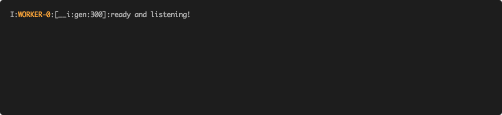

Getting Start
=============

.. contents:: :local:

Installation
------------

The best way to install the ``bert-as-service`` is via pip. Note that the server and  client can be installed separately or even on different machines:

.. highlight:: bash
.. code-block:: bash

    pip install -U bert-serving-server bert-serving-client

.. warning:: The server MUST be running on **Python >= 3.5** with **Tensorflow >= 1.10** (*one-point-ten*). Again, the server does not support Python 2!

.. note:: The client can be running on both Python 2 and 3.

Download a Pre-trained BERT Model
---------------------------------

Download a model listed below, then uncompress the zip file into some folder, say ``/tmp/english_L-12_H-768_A-12/``

List of pretrained BERT models released by Google AI:

====================================== ==================================================================================
`BERT-Base, Uncased`_                  12-layer, 768-hidden, 12-heads, 110M parameters
`BERT-Large, Uncased`_                 24-layer, 1024-hidden, 16-heads, 340M parameters
`BERT-Base, Cased`_                    12-layer, 768-hidden, 12-heads , 110M parameters
`BERT-Large, Cased`_                   24-layer, 1024-hidden, 16-heads, 340M parameters
`BERT-Base, Multilingual Cased (New)`_ 104 languages, 12-layer, 768-hidden, 12-heads, 110M parameters
`BERT-Base, Multilingual Cased (Old)`_ 102 languages, 12-layer, 768-hidden, 12-heads, 110M parameters
`BERT-Base, Chinese`_                  Chinese Simplified and Traditional, 12-layer, 768-hidden, 12-heads, 110M parameters
====================================== ==================================================================================

.. _BERT-Base, Uncased: https://storage.googleapis.com/bert_models/2018_10_18/uncased_L-12_H-768_A-12.zip
.. _BERT-Large, Uncased: https://storage.googleapis.com/bert_models/2018_10_18/uncased_L-24_H-1024_A-16.zip
.. _BERT-Base, Cased: https://storage.googleapis.com/bert_models/2018_10_18/cased_L-12_H-768_A-12.zip
.. _BERT-Large, Cased: https://storage.googleapis.com/bert_models/2018_10_18/cased_L-24_H-1024_A-16.zip
.. _BERT-Base, Multilingual Cased (New): https://storage.googleapis.com/bert_models/2018_11_23/multi_cased_L-12_H-768_A-12.zip
.. _BERT-Base, Multilingual Cased (Old): https://storage.googleapis.com/bert_models/2018_11_03/multilingual_L-12_H-768_A-12.zip
.. _BERT-Base, Chinese: https://storage.googleapis.com/bert_models/2018_11_03/chinese_L-12_H-768_A-12.zip

.. note:: As an optional step, you can also fine-tune the model on your downstream task.

.. _start_server:

Start the BERT service
----------------------

After installing the server, you should be able to use `bert-serving-start` CLI as follows:

.. highlight:: bash
.. code-block:: bash

    bert-serving-start -model_dir /tmp/english_L-12_H-768_A-12/ -num_worker=4

This will start a service with four workers, meaning that it can handle up to four **concurrent** requests. More concurrent requests will be queued in a load balancer.

Below shows what the server looks like when starting correctly:

Start the Bert service in a docker container
^^^^^^^^^^^^^^^^^^^^^^^^^^^^^^^^^^^^^^^^^^^^

Alternatively, one can start the BERT Service in a Docker Container:

.. highlight:: bash
.. code-block:: bash

    docker build -t bert-as-service -f ./docker/Dockerfile .
    NUM_WORKER=1
    PATH_MODEL=/PATH_TO/_YOUR_MODEL/
    docker run --runtime nvidia -dit -p 5555:5555 -p 5556:5556 -v $PATH_MODEL:/model -t bert-as-service $NUM_WORKER

Use Client to Get Sentence Encodes
----------------------------------

Now you can encode sentences simply as follows:

.. highlight:: python
.. code-block:: python

    from bert_serving.client import BertClient
    bc = BertClient()
    bc.encode(['First do it', 'then do it right', 'then do it better'])

It will return a ``ndarray``, in which each row is the fixed representation of a sentence. You can also let it return a pure python object with type ``List[List[float]]``.

As a feature of BERT, you may get encodes of a pair of sentences by concatenating them with ``|||``, e.g.

.. highlight:: python
.. code-block:: python

    bc.encode(['First do it ||| then do it right'])

Below shows what the server looks like while encoding:

Use BERT Service Remotely
^^^^^^^^^^^^^^^^^^^^^^^^^

One may also start the service on one (GPU) machine and call it from another (CPU) machine as follows:

.. highlight:: python
.. code-block:: python

    # on another CPU machine
    from bert_serving.client import BertClient
    bc = BertClient(ip='xx.xx.xx.xx')  # ip address of the GPU machine
    bc.encode(['First do it', 'then do it right', 'then do it better'])

.. note:: You only need ``pip install -U bert-serving-client`` in this case, the server side is not required.

**Want to learn more? Checkout our tutorials below:**
