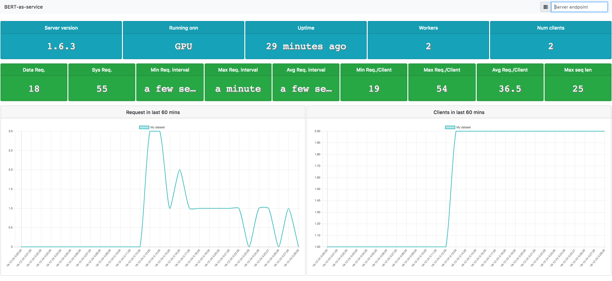

Monitoring the service status in a dashboard
============================================

.. contents:: :local:

.. note:: The complete example can `be found in plugin/dashboard/`_.

.. _be found in plugin/dashboard/: https://github.com/hanxiao/bert-as-service/blob/master/plugin/dashboard

As a part of the infrastructure, one may also want to monitor the service status and show it in a dashboard. To do that, we can use:

.. highlight:: python
.. code:: python

   bc = BertClient(ip='server_ip')

   json.dumps(bc.server_status, ensure_ascii=False)

This gives the current status of the server including number of requests, number of clients, etc. in JSON format. The only thing remained is to start a HTTP server for returning this JSON to the frontend that renders it.

``plugin/dashboard/index.html`` shows a simple dashboard based on Bootstrap and Vue.js.

